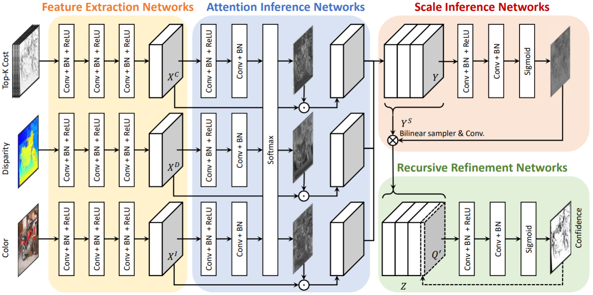

# LAF-Net: Locally Adaptive Fusion Networks for Stereo Confidence Estimation


Official PyTorch code of "LAF-Net: Locally Adaptive Fusion Networks for Stereo Confidence Estimation," 
Sunok Kim, [Seungryong Kim](https://seungryong.github.io/), [Dongbo Min](http://cvl.ewha.ac.kr/), [Kwanghoon Sohn](http://diml.yonsei.ac.kr/), CVPR 2019 (Oral) [[Project Page](https://seungryong.github.io/LAFNet/)].

<p align="center">
  </img>
</p>

## Abstract ##
We present a novel method that estimates confidence map of an initial disparity by making full use of tri-modal input, including matching cost, disparity, and color image through deep networks. The proposed network, termed as Locally Adaptive Fusion Networks (LAF-Net), learns locally-varying attention and scale maps to fuse the trimodal confidence features. The attention inference networks encode the importance of tri-modal confidence features and then concatenate them using the attention maps in an adaptive and dynamic fashion. This enables us to make an optimal fusion of the heterogeneous features, compared to a simple concatenation technique that is commonly used in conventional approaches. In addition, to encode the confidence features with locally-varying receptive fields, the scale inference networks learn the scale map and warp the fused confidence features through convolutional spatial transformer networks. Finally, the confidence map is progressively estimated in the recursive refinement networks to enforce a spatial context and local consistency. Experimental results show that this model outperforms the state-ofthe-art methods on various benchmarks.

## Getting started ##
Download KITTI data, containing color images, initial disparity maps, and cost volumes 
of first 20 images in KITTI 2012 benchmark (for training) and 200 images in KITTI 2015 benchmark (for evaluation), at the following link:
* [KITTI-data](https://drive.google.com/file/d/1SDrqZ_iT86HhsE6ycV12nDLbjDrjU1ei/view?usp=sharing)

It contains the data generated with MC-CNN stereo matcher. Please see the paper for details. 

## Evaluation ##
Download the pre-trained model at the following link and save at `saved_models` folder :
* [LAF-Net](https://drive.google.com/file/d/1zAiXI86qYNhfwohj4CB8kn_IJqVGshYx/view?usp=sharing)

or train the network from scratch.

Launch the following command:
```shell
python evaluate.py
```

It evaluates the LAF-Net on KITTI 2015 benchmark. Please see the paper for details. 

## Training ##
Launch the following command:
```shell
sh train.sh
```
or 
```shell
python train.py
```
Optional arguments:
* `--base_lr` learning rate
* `--batch_size` batch size
* `--num_epochs` maximum epoch
* `--step_size_lr` step size for adjusting learning rate
* `--gamma_lr` gamma for adjusting learning rate

## Citation
If you use this code for your research, please cite the following paper. 
```shell
@inproceedings{Kim_CVPR_2019,
  title     = {LAF-Net: Locally Adaptive Fusion Networks For Stereo Confidence Estimation},
  author    = {Kim, Sunok and Kim, Seungryong and Min, Dongbo and Sohn, Kwanghoon},
  booktitle = {IEEE/CVF Conference on Computer Vision and Pattern Recognition (CVPR)},
  year = {2019}
}
```   

## Acknowledgements

Thanks to [Matteo Poggi](https://mattpoggi.github.io/) for sharing KITTI data and AUC code.
